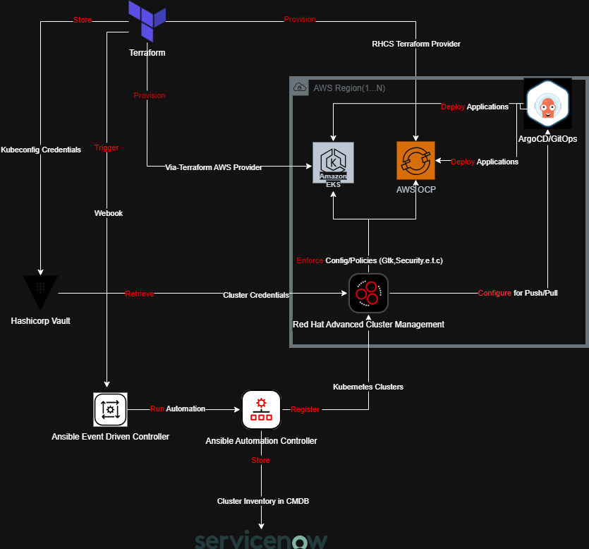

# ADP HashiCorp Architecture Proposal

## Overview

This repository contains the architectural proposal for an ADP (Automatic Data Processing) system utilizing HashiCorp tools and technologies. The  illustrates the comprehensive infrastructure design for a modern, scalable, and secure data processing platform.

## Architecture Description

Based on the architectural diagram, this proposal outlines a robust infrastructure solution leveraging HashiCorp's and Red Hat's suite of tools to manage multi-cloud kubernetes solutions.